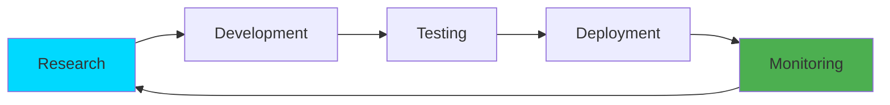

<div align="center">


<!-- Logo with Animation -->


<!-- Typing Animation -->
<a href="https://git.io/typing-svg"></a>

<!-- Enhanced Badges -->
<p>
  
  
  
</p>

<!-- Organization Stats -->
<p>
  
  
  <a href="mailto:support@dynamicdev.asia"></a>
</p>

</div>

---

## 🎯 **Our Mission**

<table>
<tr>
<td width="50%">

### 💡 **Vision**
> *Bridging the gap between field-proven engineering and scalable software solutions*

We don't just build systems – we **engineer ecosystems** that thrive in real-world environments.

</td>
<td width="50%">

### 🎓 **Expertise**
- ✅ Full-Cycle Network Deployment
- ✅ Comprehensive IT System Support
- ✅ Home Lab Research & Validation
- ✅ Production-Ready Infrastructure

</td>
</tr>
</table>

---

## 🏢 **About dynamicdev_**

<table>
<tr>
<td width="60%">

**📍 Headquarters**  
Rama II - Bangkhunthien, Bangkok, Thailand

**🌐 Contact Information**
- **Support Email:** [support@dynamicdev.asia](mailto:support@dynamicdev.asia)
- **Partnership:** [james.dynamicdev@gmail.com](mailto:james.dynamicdev@gmail.com)
- **GitHub Org:** [@dynamicdev-official](https://github.com/dynamicdev-official)

**🔬 Our Methodology**

We validate every system in **real-world Home Lab environments** before deployment, ensuring maximum reliability and performance in production scenarios.

</td>
<td width="40%">

```ascii
╔═══════════════════════╗
║   OUR PRINCIPLES      ║
╠═══════════════════════╣
║ 🎯 Innovation-Driven  ║
║ 🔒 Security-First     ║
║ ⚡ Performance        ║
║ 🛡️ Reliability        ║
║ 🔬 Research-Based     ║
║ 🚀 Scalable Design    ║
╚═══════════════════════╝
```

</td>
</tr>
</table>

---

## 🚀 **The Ecosystem Portfolio**

<div align="center">

### 🌟 **Active Projects & Solutions**

</div>

<table>
<tr>
<td width="33%" align="center">


### 🎫 **syscare-dynamicdev**


**IT Support & Ticket Management**

An optimized system tailored for field operations with real-time tracking, automation, and comprehensive reporting capabilities.

**Key Features:**
- ✨ Real-time Ticket Tracking
- 🤖 Automated Workflows
- 📊 Analytics Dashboard
- 🔔 Smart Notifications

[](https://github.com/dynamicdev-official/syscare-dynamicdev)

</td>
<td width="33%" align="center">


### 🤖 **dynamicdev_agent**


**Intelligent AI Agent**

Autonomous backend management system with advanced workflow automation and intelligent decision-making capabilities.

**Key Features:**
- 🧠 AI-Driven Automation
- 🔄 Workflow Orchestration
- 📈 Performance Optimization
- 🛠️ Self-Healing Systems

[](https://github.com/dynamicdev-official/dynamicdev_agent)

</td>
<td width="33%" align="center">


### 🌐 **Network Research**


**Network Engineering Tools**

Advanced solutions for simplifying complex networking device management and optimization.

**Focus Areas:**
- 🔧 Device Management
- 📡 Network Monitoring
- ⚙️ Configuration Automation
- 🔍 Performance Analysis

[](#)

</td>
</tr>
</table>

---

## 💻 **Technology Stack**

<div align="center">

### **Infrastructure & DevOps**
<p>
  
  
  
  
  
</p>

### **Development & Programming**
<p>
  
  
  
  
</p>

### **Networking & Certification**
<p>
  
  
  
  
</p>

### **Enterprise Systems**
<p>
  
  
  
  
</p>

</div>

---

## 📊 **Organization Overview**

<div align="center">

<table>
<tr>
<td align="center" width="25%">

### 🎯 **Active Projects**


Public & Private Repositories

</td>
<td align="center" width="25%">

### 🌟 **Tech Focus**


Network & System Solutions

</td>
<td align="center" width="25%">

### 🔬 **Research Areas**


Home Lab Validated

</td>
<td align="center" width="25%">

### 📍 **Location**


Southeast Asia Hub

</td>
</tr>
</table>

</div>

---

## 🗂️ **Repository Catalog**

<div align="center">

| Repository | Description | Status | Tech Stack |
|:-----------|:------------|:-------|:-----------|
| **[syscare-dynamicdev](https://github.com/dynamicdev-official/syscare-dynamicdev)** | IT Support & Ticket Management Platform |  | Python, FastAPI, React |
| **[dynamicdev_agent](https://github.com/dynamicdev-official/dynamicdev_agent)** | Intelligent AI Automation Agent |  | Python, AI/ML |
| **Network Research** | Network Engineering Tools |  | Python, Network APIs |

</div>

---

## 🤝 **Connect With Us**

<div align="center">

<table>
<tr>
<td align="center" width="33%">

### 🎫 **Technical Support**

For system support and service inquiries

<a href="mailto:support@dynamicdev.asia">
  
</a>

</td>
<td align="center" width="33%">

### 🤝 **Business Partnerships**

Collaboration and partnership opportunities

<a href="mailto:james.dynamicdev@gmail.com">
  
</a>

</td>
<td align="center" width="33%">

### 🌐 **Follow Our Work**

Stay updated with our latest projects

<a href="https://github.com/dynamicdev-official">
  
</a>

</td>
</tr>
</table>

<br>

### 📢 **Social & Community**

<p>
  <a href="https://github.com/dynamicdev-official" target="_blank">
    
  </a>
  <a href="https://github.com/dynamicdev-jamesdynamicdev" target="_blank">
    
  </a>
  <a href="mailto:support@dynamicdev.asia">
    
  </a>
</p>

</div>

---

## 🎖️ **Our Commitment**

<div align="center">

```ascii
╔══════════════════════════════════════════════════════════════════════════════╗
║                                                                              ║
║        🎯 Innovation-Driven  |  🔒 Security-First  |  ⚡ Performance          ║
║                                                                              ║
║              We build systems that don't just work – they excel.            ║
║                                                                              ║
╚══════════════════════════════════════════════════════════════════════════════╝
```

<br>

### ✨ **Why Choose dynamicdev_?**

<table>
<tr>
<td align="center" width="25%">

#### 🔬 **Research-Based**
Every solution tested in real-world lab environments

</td>
<td align="center" width="25%">

#### 🏗️ **Production-Ready**
Enterprise-grade quality from day one

</td>
<td align="center" width="25%">

#### 🚀 **Scalable**
Built to grow with your needs

</td>
<td align="center" width="25%">

#### 🛡️ **Reliable**
Field-proven reliability you can trust

</td>
</tr>
</table>

</div>

---

## 🌟 **Featured Highlights**

<div align="center">

<table>
<tr>
<td align="center" width="50%">

### 🏆 **Our Approach**



**Continuous Innovation Cycle**

</td>
<td align="center" width="50%">

### 📈 **Growth Trajectory**

| Milestone | Status |
|:----------|:------:|
| Foundation Setup | ✅ |
| Core Products Launch | ✅ |
| AI Integration | 🔄 |
| Network Tools Release | 📅 |
| Global Expansion | 📋 |

</td>
</tr>
</table>

</div>

---

## 💼 **Services & Solutions**

<div align="center">

| Service Category | What We Offer | Target Audience |
|:-----------------|:--------------|:----------------|
| 🎫 **IT Support Management** | Comprehensive ticket & incident management systems | SMBs, IT Teams |
| 🤖 **Automation Solutions** | AI-powered workflow automation & optimization | Enterprises, DevOps |
| 🌐 **Network Engineering** | Infrastructure design, deployment & management | Network Engineers |
| 🔧 **System Integration** | Custom integration & API development | Tech Companies |

</div>

---

<div align="center">

<!-- Profile Views Counter -->


<br><br>

### ⭐ **Star Our Repositories** | 🔔 **Watch for Updates** | 🍴 **Fork to Contribute**

---


**Copyright © 2026 dynamicdev_ official — All Rights Reserved**

*Built with ❤️ in Bangkok, Thailand*

</div>
